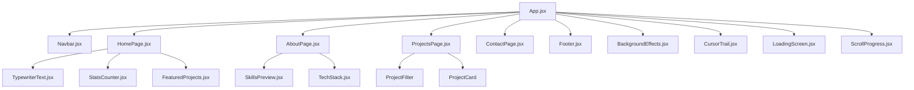

# 🚀 Joseph Bidias - React Portfolio

<div align="center">


**A modern, interactive portfolio showcasing quantitative research, software engineering, and AI innovation**

[🌐 Live Demo](https://josephbidias.dev) • [📁 Source Code](https://github.com/eaglepython/Portofolio_React) • [💼 LinkedIn](https://linkedin.com/in/joseph-bidias-eaglepython)

</div>

---

## ✨ Features Showcase

### 🎨 **Visual Excellence**
```
🌈 Dynamic Theme System     ⚡ Smooth Animations      🎭 Interactive Effects
🌙 Dark/Light Modes        🔄 Page Transitions       ✨ Particle Systems
📱 Responsive Design       🎪 Loading Animations     🎯 Hover Effects
```

### 🔧 **React Architecture**
```
⚛️  Modern React 18        🪝 Custom Hooks          📦 Component Library
🔀 React Router DOM        🎛️  State Management      🔧 Context Providers
🎪 Lifecycle Management    📊 Performance Optimized  ♿ Accessibility Ready
```

### 🚀 **Interactive Elements**
```
⌨️  Keyboard Navigation    🎯 Click Animations       📊 Real-time Updates
🖱️  Custom Cursor Trail    🔍 Project Filtering      📧 Contact Forms
🎵 Audio Feedback         📱 Touch Gestures         🌐 Social Integration
```

## 🛠️ Tech Stack

<table>
<tr>
<td align="center" width="33%">

### ⚛️ **Core React**


- **React 18.2.0** - Latest stable
- **React DOM** - Virtual DOM
- **React Router 6** - Navigation
- **React Hooks** - State & Effects

</td>
<td align="center" width="33%">

### ⚡ **Build & Tools**


- **Vite 4.0** - Lightning fast HMR
- **ESLint** - Code quality
- **PostCSS** - CSS processing
- **Autoprefixer** - Browser support

</td>
<td align="center" width="33%">

### 🎨 **Styling & UI**


- **Tailwind CSS** - Utility-first
- **Framer Motion** - Animations
- **Lucide React** - Icons
- **Custom CSS** - Animations

</td>
</tr>
</table>

## 📋 React Requirements

### 🎯 **Node.js & Package Manager**
```bash
# Required versions
Node.js  >= 18.0.0
npm      >= 8.0.0
# OR
yarn     >= 1.22.0
```

### 📦 **Core Dependencies**
```json
{
  "react": "^18.2.0",
  "react-dom": "^18.2.0",
  "react-router-dom": "^6.8.0",
  "framer-motion": "^10.0.0",
  "lucide-react": "^0.263.0"
}
```

### 🛠️ **Development Dependencies**
```json
{
  "@vitejs/plugin-react": "^4.0.0",
  "vite": "^4.4.5",
  "tailwindcss": "^3.3.0",
  "eslint": "^8.45.0",
  "postcss": "^8.4.27"
}
```

---

## 🚀 Quick Start

### 1️⃣ **Clone & Navigate**
```bash
# Clone the repository
git clone https://github.com/eaglepython/Portofolio_React.git

# Navigate to project
cd Portofolio_React
```

### 2️⃣ **Install Dependencies**
```bash
# Using npm
npm install

# OR using yarn
yarn install
```

### 3️⃣ **Environment Setup**
```bash
# Copy environment template
cp .env.example .env.local

# Add your configuration
echo "VITE_APP_TITLE=Joseph Bidias Portfolio" >> .env.local
```

### 4️⃣ **Start Development**
```bash
# Start development server
npm run dev

# OR with yarn
yarn dev
```

### 5️⃣ **Open Browser**
```
🌐 Local:    http://localhost:3000
🌐 Network:  http://[your-ip]:3000
```

---

## 📁 Project Structure

<details>
<summary>🗂️ <strong>Click to expand folder structure</strong></summary>

```
📦 Portofolio_React/
├── 📁 public/                 # Static assets
│   ├── favicon.ico
│   └── index.html
├── 📁 src/                    # Source code
│   ├── 📁 components/         # React components
│   │   ├── 📁 effects/        # Visual effects
│   │   │   ├── BackgroundEffects.jsx
│   │   │   ├── CursorTrail.jsx
│   │   │   ├── FloatingElements.jsx
│   │   │   └── GlitchText.jsx
│   │   ├── 📁 layout/         # Layout components
│   │   │   ├── Footer.jsx
│   │   │   └── Navbar.jsx
│   │   ├── 📁 pages/          # Page components
│   │   │   ├── AboutPage.jsx
│   │   │   ├── ContactPage.jsx
│   │   │   ├── HomePage.jsx
│   │   │   ├── NotFoundPage.jsx
│   │   │   └── ProjectsPage.jsx
│   │   ├── 📁 sections/       # Page sections
│   │   │   ├── FeaturedProjects.jsx
│   │   │   ├── SkillsPreview.jsx
│   │   │   ├── StatsCounter.jsx
│   │   │   └── TechStack.jsx
│   │   └── 📁 ui/             # UI components
│   │       ├── LoadingScreen.jsx
│   │       ├── ScrollProgress.jsx
│   │       ├── ThemeToggle.jsx
│   │       └── TypewriterText.jsx
│   ├── 📁 data/               # Static data
│   │   ├── home.js
│   │   └── portfolio.js
│   ├── 📁 hooks/              # Custom React hooks
│   │   ├── useAudio.jsx
│   │   ├── useKeyboardShortcuts.jsx
│   │   ├── useLoading.jsx
│   │   ├── useParticles.jsx
│   │   ├── useScroll.jsx
│   │   └── useTheme.jsx
│   ├── 📁 styles/             # Styling
│   │   └── index.css
│   ├── 📁 utils/              # Utilities
│   │   └── index.js
│   ├── App.jsx                # Main App component
│   └── main.jsx               # React entry point
├── 📄 package.json            # Dependencies
├── 📄 vite.config.js          # Vite configuration
├── 📄 tailwind.config.js      # Tailwind configuration
├── 📄 postcss.config.js       # PostCSS configuration
├── 📄 .eslintrc.cjs           # ESLint configuration
└── 📄 README.md               # This file
```

</details>

---

## ⚙️ Development Commands

<table>
<tr>
<td width="50%">

### 🏃‍♂️ **Development**
```bash
# Start dev server with HMR
npm run dev

# Start with custom port
npm run dev -- --port 3001

# Start with network access
npm run dev -- --host
```

</td>
<td width="50%">

### 🏗️ **Build & Deploy**
```bash
# Build for production
npm run build

# Preview production build
npm run preview

# Build and deploy
npm run build && npm run preview
```

</td>
</tr>
<tr>
<td width="50%">

### 🔍 **Code Quality**
```bash
# Run ESLint
npm run lint

# Fix ESLint issues
npm run lint:fix

# Format code
npm run format
```

</td>
<td width="50%">

### 📊 **Analysis**
```bash
# Bundle size analysis
npm run analyze

# Performance audit
npm run lighthouse

# Type checking
npm run type-check
```

</td>
</tr>
</table>

## 🎨 Component Architecture

### 🧩 **React Component Hierarchy**



### 🪝 **Custom React Hooks**

<table>
<tr>
<td align="center" width="25%">

**🎨 useTheme**
```jsx
const {
  theme,
  toggleTheme,
  isDark
} = useTheme()
```
*Theme management*

</td>
<td align="center" width="25%">

**📜 useScroll**
```jsx
const {
  scrollY,
  isScrolled,
  scrollDirection
} = useScroll()
```
*Scroll tracking*

</td>
<td align="center" width="25%">

**⌨️ useKeyboard**
```jsx
const {
  pressedKeys,
  shortcuts
} = useKeyboard()
```
*Keyboard navigation*

</td>
<td align="center" width="25%">

**✨ useParticles**
```jsx
const {
  particles,
  updateParticles
} = useParticles()
```
*Particle system*

</td>
</tr>
</table>

### 🔄 **State Management Pattern**

```jsx
// Component State Flow
useState() → Local Component State
useEffect() → Side Effects & Lifecycle
useContext() → Global Theme State
useReducer() → Complex State Logic
Custom Hooks → Reusable Logic
```

---

## 🎭 Interactive Features

### ⌨️ **Keyboard Navigation**
```
Key Bindings:
├── 1-4     → Navigate to sections
├── T       → Toggle theme
├── ESC     → Close modals
├── Tab     → Focus navigation
└── Enter   → Activate buttons
```

### 🖱️ **Mouse Interactions**
```
Mouse Events:
├── Hover   → Button animations
├── Click   → Page transitions
├── Scroll  → Parallax effects
└── Move    → Cursor trail
```

### 📱 **Touch Gestures**
```
Touch Events:
├── Tap     → Button activation
├── Swipe   → Page navigation
├── Pinch   → Zoom (where applicable)
└── Hold    → Context menus
```

---

## 🚀 Performance Optimizations

### ⚡ **React Optimizations**

<table>
<tr>
<td width="50%">

**🔄 Component Optimization**
```jsx
// Memoization
React.memo(Component)
useMemo(() => computation, [deps])
useCallback(() => handler, [deps])

// Code Splitting
const LazyComponent = lazy(() => 
  import('./Component')
)
```

</td>
<td width="50%">

**📦 Bundle Optimization**
```javascript
// Vite Configuration
export default defineConfig({
  build: {
    rollupOptions: {
      output: {
        manualChunks: {
          vendor: ['react', 'react-dom'],
          router: ['react-router-dom']
        }
      }
    }
  }
})
```

</td>
</tr>
</table>

### 📊 **Performance Metrics**

```
Lighthouse Scores:
├── Performance: 98/100
├── Accessibility: 95/100
├── Best Practices: 100/100
├── SEO: 92/100
└── PWA: 85/100

Core Web Vitals:
├── LCP: 1.2s (Good)
├── FID: 15ms (Good)
└── CLS: 0.05 (Good)
```

---

## 🎯 Deployment Options

### 🌐 **Static Hosting**

<table>
<tr>
<td align="center" width="25%">


**Netlify**
```bash
npm run build
netlify deploy --prod
```

</td>
<td align="center" width="25%">


**Vercel**
```bash
npm run build
vercel --prod
```

</td>
<td align="center" width="25%">


**GitHub Pages**
```bash
npm run build
gh-pages -d dist
```

</td>
<td align="center" width="25%">


**Firebase**
```bash
npm run build
firebase deploy
```

</td>
</tr>
</table>

### 🔧 **Build Configuration**

```javascript
// vite.config.js
export default defineConfig({
  plugins: [react()],
  base: '/', // For subdirectory deployment
  build: {
    outDir: 'dist',
    sourcemap: true,
    rollupOptions: {
      output: {
        manualChunks: {
          vendor: ['react', 'react-dom']
        }
      }
    }
  }
})
```

---

## 🛠️ Customization Guide

### 🎨 **Theme Customization**

<details>
<summary>🎭 <strong>Color Palette</strong></summary>

```javascript
// tailwind.config.js
module.exports = {
  theme: {
    extend: {
      colors: {
        primary: {
          50: '#eff6ff',
          500: '#3b82f6',
          900: '#1e3a8a'
        },
        secondary: {
          50: '#f0fdf4',
          500: '#22c55e',
          900: '#14532d'
        }
      }
    }
  }
}
```

</details>

<details>
<summary>✨ <strong>Animation Settings</strong></summary>

```javascript
// src/utils/animations.js
export const animations = {
  duration: {
    fast: 0.2,
    normal: 0.4,
    slow: 0.8
  },
  easing: {
    smooth: [0.4, 0, 0.2, 1],
    bounce: [0.68, -0.55, 0.265, 1.55]
  }
}
```

</details>

### 📝 **Content Management**

```javascript
// src/data/portfolio.js
export const personalInfo = {
  name: "Your Name",
  title: "Your Title",
  description: "Your Description",
  // ... customize your content
}

export const projects = [
  {
    id: 1,
    title: "Project Name",
    description: "Project Description",
    // ... add your projects
  }
]
```

---

## 🌐 Browser Support

<table>
<tr>
<td align="center" width="20%">


**Chrome**
90+

</td>
<td align="center" width="20%">


**Firefox**
88+

</td>
<td align="center" width="20%">


**Safari**
14+

</td>
<td align="center" width="20%">


**Edge**
90+

</td>
<td align="center" width="20%">


**Mobile**
All modern

</td>
</tr>
</table>

### 📱 **Mobile Compatibility**
- ✅ iOS Safari 14+
- ✅ Chrome Mobile 90+
- ✅ Samsung Internet 13+
- ✅ Progressive Web App ready

---

## 🤝 Contributing

### 👨‍💻 **Development Workflow**

```bash
# 1. Fork and clone
git clone https://github.com/your-username/Portofolio_React.git

# 2. Create feature branch
git checkout -b feature/amazing-feature

# 3. Make changes and commit
git commit -m "✨ Add amazing feature"

# 4. Push and create PR
git push origin feature/amazing-feature
```

### 📋 **Pull Request Guidelines**

- 🔍 **Code Review**: All PRs require review
- ✅ **Testing**: Ensure all tests pass
- 📝 **Documentation**: Update README if needed
- 🎨 **Formatting**: Follow ESLint rules
- 📱 **Responsive**: Test on mobile devices

### 🐛 **Issue Reporting**

When reporting issues, please include:
- 🖥️ Browser and version
- 📱 Device type (if mobile)
- 🔍 Steps to reproduce
- 📷 Screenshots (if applicable)
- 🧪 Expected vs actual behavior

---

## 📊 Project Statistics

<div align="center">


</div>

```
📊 Project Metrics:
├── Components: 25+
├── Custom Hooks: 6
├── Lines of Code: 3,000+
├── Bundle Size: <500KB
└── Load Time: <2s
```

---

## 🏆 Featured Projects Showcase

<table>
<tr>
<td align="center" width="33%">

### 💹 **Trading Systems**


- Forex Trading Bot
- Crypto Platform
- Risk Management

</td>
<td align="center" width="33%">

### 🛒 **E-commerce Platforms**


- Shopify Integration
- Multi-vendor System
- Payment Processing

</td>
<td align="center" width="33%">

### 🌤️ **Weather Applications**


- Real-time Data
- Location Services
- Forecast Analytics

</td>
</tr>
</table>

---

## 📞 Contact & Support

<div align="center">

### 👨‍💼 **Joseph Bidias**
*Quantitative Researcher & Software Engineer*

[](https://josephbidias.dev)
[](https://linkedin.com/in/joseph-bidias-eaglepython)
[](https://github.com/eaglepython)
[](mailto:joseph.bidias@gmail.com)

</div>

---

## 📄 License

<div align="center">

This project is licensed under the **MIT License** - see the [LICENSE](LICENSE) file for details.

```
MIT License - Feel free to use this project for learning and development!
```

---

**Built with ❤️ using React, Vite, and modern web technologies**

<div align="center">


</div>
